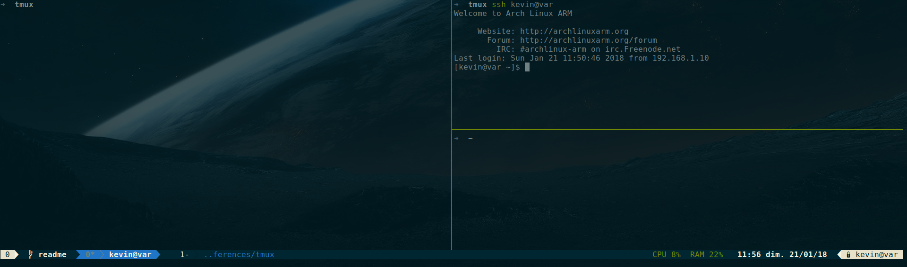

# Tmux Conf
Simple tmux conf



## Installation
Requirements:
- tmux 
- [nerd-fonts](https://github.com/ryanoasis/nerd-fonts)

Installation:

```shell
git clone https://gitlab.com/Tomahna/tmux.git
export TMUXDOTDIR=$(pwd)/tmux
tmux -f ~/.config/tmux/tmux.conf
```
